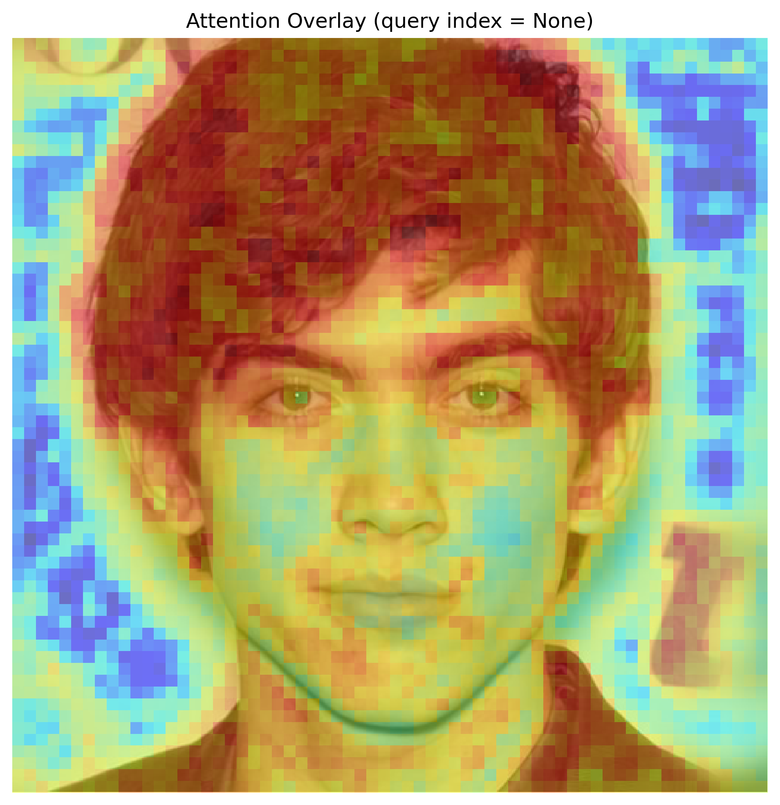

# StyleID_Backup


# 설명서

## Inference
```yaml
python run_ori.py --cnt data_vis/cnt --sty data_vis/sty
```
--------

### data_vis: 실제 inference 시에 사용하는 이미지가 담겨있는 폴더

 

### ldm/modules/attention.py: 마스크 적용이나 q, k, sim 저장을 추가로 구현해놓음

### output_dk: inference 결과 저장 폴더

### prcomputed_feats_k: 각종 pkl 파일 저장하는 폴더

### saved_qk, sim: histogram을 그리기 위해서 q, k와 sim의 pkl을 저장해놓는 폴더

### attn_map_cal.py: 실제 사용법은 [https://www.notion.so/dgu-ion/Alpha-255da266be2d806d8e6ff9e20a45ed76?source=copy_link](https://www.notion.so/255da266be2d806d8e6ff9e20a45ed76?pvs=21) 참조.

### attn_histogram_results: 위에서 결과 이미지가 저장되는 폴더

### attn_map_viz.py: attention map 시각화하는 코드



### generate_pkl_only.py: 말 그대로 pkl을 만들기 위해서 inference전에 inversion까지만 진행하는 코드.

```yaml
python generate_pkl_only.py --cnt data_vis/cnt --sty data_vis/sty
python generate_pkl_only.py --cnt data_vis/cnt
python generate_pkl_only.py --sty data_vis/sty
```

세가지 모두 사용 가능.

단, inversion시에 사용하는 모델은 StyleId와 같음. 따라서 attention에서 마스크 적용하는 부분의 코드를 논문 원본의 코드로 되돌려줘야함.

```yaml
# ##################### 마스크 적용 시작 ######################
#     # print(f"마스크 적용 안함, sim.shape: {sim.shape} \n")
# ################# 마스크 적용 끝 ###################
  
################## 원본 ###################
sim = einsum('b i d, b j d -> b i j', q, k)

sim *= self.scale
self.qk_sim = sim

if exists(mask):
    mask = rearrange(mask, 'b ... -> b (...)')
    max_neg_value = -torch.finfo(sim.dtype).max
    mask = repeat(mask, 'b j -> (b h) () j', h=h)
    sim.masked_fill_(~mask, max_neg_value)

# attention, what we cannot get enough of
attn = sim.softmax(dim=-1)
self.attn = attn

out = einsum('b i j, b j d -> b i d', attn, v)
out = rearrange(out, '(b h) n d -> b n (h d)', h=h)
################## 원본 끝 ###################
```

위처럼 마스크 적용하는 부분의 시작과 끝은 주석처리하고 원본의 시작과 끝을 주석해제해서 사용할 것.

여기서 pkl파일은 위에서 말한 precomputed_feats_k 폴더에 저장됨.

### gradio_make_mask.py: fastsam으로 마스크 만들지 못하는 경우 대비하여 gradio상에서 직접 마스크 손으로 만드는 코드

### make_mask_npy.py: 마스크 이미지를 입력으로 받아 npy로 만들어주는 코드

### hf_run.py, high_frequency_final.py: 예령님 설명 참조

# Citation

```BibTeX

@InProceedings{Chung_2024_CVPR,
    author    = {Chung, Jiwoo and Hyun, Sangeek and Heo, Jae-Pil},
    title     = {Style Injection in Diffusion: A Training-free Approach for Adapting Large-scale Diffusion Models for Style Transfer},
    booktitle = {Proceedings of the IEEE/CVF Conference on Computer Vision and Pattern Recognition (CVPR)},
    month     = {June},
    year      = {2024},
    pages     = {8795-8805}
}
```
